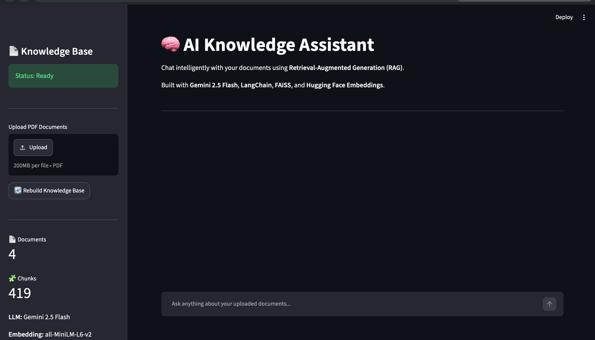
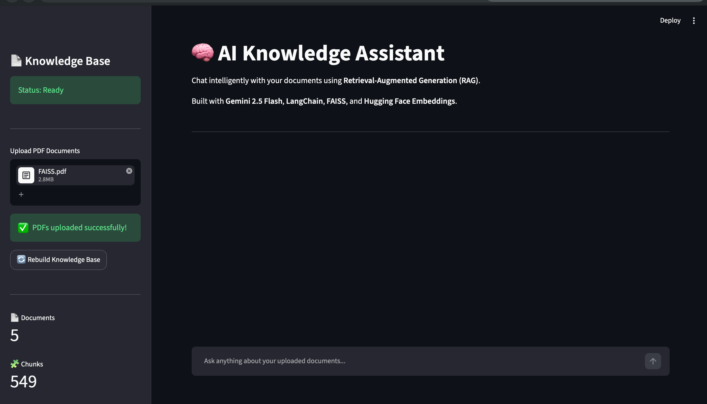
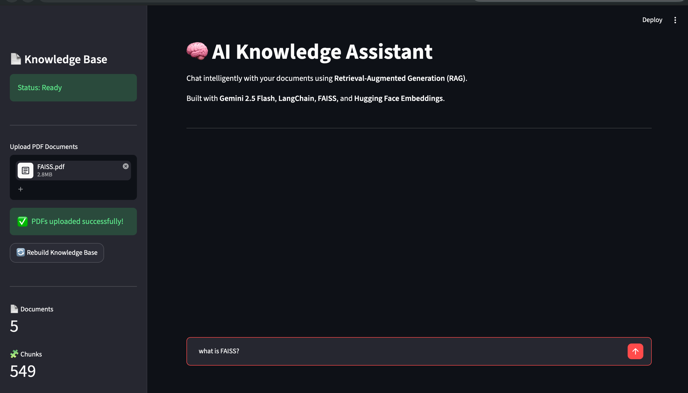
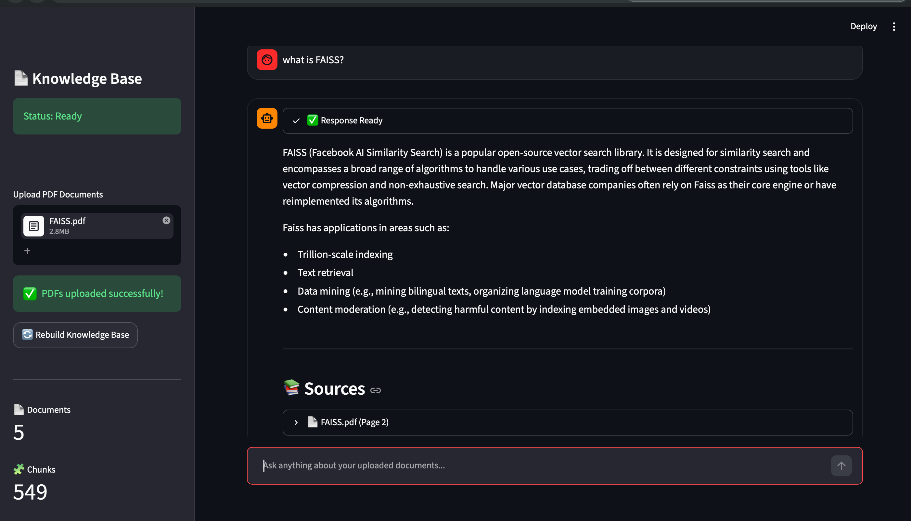
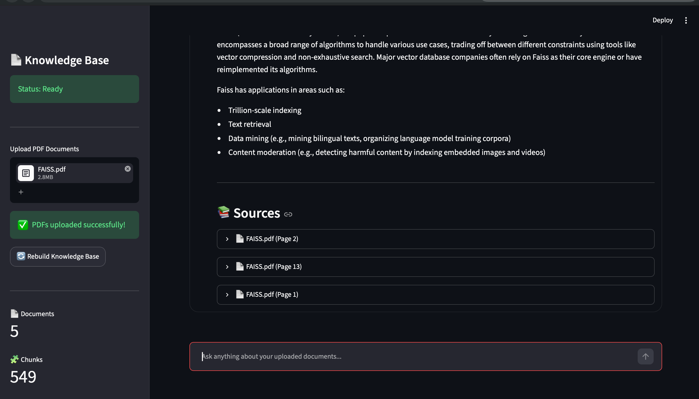

# 🧠 AI Knowledge Assistant


An intelligent **Retrieval-Augmented Generation (RAG)** chatbot that enables users to upload PDF documents and ask questions in natural language. The application retrieves the most relevant document chunks using **FAISS** with **Maximum Marginal Relevance (MMR)** retrieval and generates context-aware responses using **Google Gemini 2.5 Flash**.

---

## 🌐 Live Demo

🚧 **Coming Soon**

*(Will be updated after deployment on Streamlit Community Cloud.)*

---

# 📸 Application Preview

## 🏠 Home Screen



---

## 📄 Upload Documents



---

## ❓ Ask Questions



---

## 🤖 AI Generated Answer



---

## 📚 Source Attribution



---

# ✨ Features

- 📄 Upload and index multiple PDF documents
- 🔍 Semantic document retrieval using **FAISS**
- 🧠 Context-aware responses powered by **Google Gemini 2.5 Flash**
- 💬 Multi-turn conversation memory
- 📚 Source attribution with expandable document context
- 🔄 Dynamic Knowledge Base rebuilding
- ⚡ Maximum Marginal Relevance (MMR) retrieval
- 🎨 Interactive Streamlit web interface
- 🤖 Retrieval-Augmented Generation (RAG) pipeline

---

# 🏗️ System Architecture


---

# 🧠 RAG Pipeline

The application follows a complete Retrieval-Augmented Generation workflow:

1. User uploads one or more PDF documents.
2. Documents are loaded using LangChain document loaders.
3. Text is split into overlapping chunks.
4. Hugging Face embeddings are generated for each chunk.
5. Embeddings are stored inside a FAISS vector database.
6. User submits a natural language query.
7. Maximum Marginal Relevance (MMR) retrieves the most relevant chunks.
8. Retrieved context is combined with the user query.
9. Google Gemini 2.5 Flash generates a grounded response.
10. The chatbot displays both the answer and the supporting source documents.

---

# ⚙️ Tech Stack

| Category | Technology |
|-----------|------------|
| Language | Python 3.11 |
| UI Framework | Streamlit |
| LLM | Google Gemini 2.5 Flash |
| Framework | LangChain |
| Embeddings | BAAI/bge-small-en-v1.5 |
| Vector Database | FAISS |
| ML Library | Sentence Transformers |
| Environment | python-dotenv |

---

# 📂 Project Structure

```text
rag_chatbot/
│
├── app.py
├── config.py
├── prompts.py
├── requirements.txt
├── README.md
│
├── core/
│   ├── ingest.py
│   ├── rag_chain.py
│   └── __init__.py
│
├── ui/
│   ├── chat.py
│   ├── sidebar.py
│   ├── styles.py
│   └── __init__.py
│
├── data/
│   └── pdfs/
│
├── vectorstore/
│
├── assets/
│   └── architecture.png
│
└── screenshots/
```

---

## 🚀 Installation

```bash
git clone https://github.com/Snehaa204/ai-knowledge-assistant-rag.git

cd ai-knowledge-assistant-rag

python -m venv venv

source venv/bin/activate

pip install -r requirements.txt
```

Create a `.env` file:

```text
GOOGLE_API_KEY=your_api_key_here
```

Run:

```bash
streamlit run app.py
```

---

## 📄 Adding Your Own Documents

This repository does not include PDF documents.

Place your own PDFs inside:

```text
data/pdfs/
```

Then rebuild the knowledge base from the Streamlit sidebar by clicking:

**🔄 Rebuild Knowledge Base**

# 💻 Usage

1. Upload one or more PDF documents.
2. Click **Rebuild Knowledge Base**.
3. Wait for document indexing to complete.
4. Ask questions in natural language.
5. View AI-generated responses.
6. Expand the **Sources** section to inspect retrieved document chunks.

---

# 📈 Example Questions

Try asking questions like:

- What is Streamlit?
- Explain Python decorators.
- What is LangChain?
- How does FAISS work?
- What are vector embeddings?
- Summarize this document.
- What are the key concepts discussed?

---

# 🔮 Future Improvements

- Hybrid Search (BM25 + Dense Retrieval)
- Cross-Encoder Reranking
- OCR support for scanned PDFs
- Support for DOCX and TXT files
- User Authentication
- Chat Export (PDF/Markdown)
- Retrieval Evaluation (RAGAS)
- Docker Deployment
- Multi-user Support

---

# 👩‍💻 Author

**Sneha Meena**

GitHub: https://github.com/Snehaa204

LinkedIn: https://linkedin.com/in/sneha-meena

---

# ⭐ Support

If you found this project useful, consider giving it a ⭐ on GitHub!